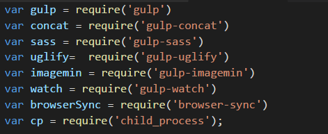

Se você caiu de paraquedas neste post, prazer, me chamo Maurício, no momento tenho 16 anos e este é o primeiro post do meu blog. Para o primeiro post, nada melhor que explicar os motivos da criação e também as tecnologias que eu utilizei para dar vida ao meu primeiro blog.

## Compartilhar conhecimento
Meu nível de conhecimento ainda é raso, entretanto, eu quero compartilhar as minhas experiências iniciais no longo caminho do desenvolvimento. Eu queria aguardar, continuar estudando e começar a compartilhar aprendizados quando estivesse pronto, em um nível mais elevado, mas a verdade é que nós nunca vamos estar prontos, nunca vamos estar satisfeito com o nível de conhecimento e isso é bom, quanto mais aprendemos algo, mais nós percebemos o tamanho de nossa ignorância. A evolução na área de tecnologia deve ser constante, por meio desse blog quero compartilhar esta minha evolução.

## Aprender para compartilhar
Meu objetivo é: aprender para compartilhar. A melhor forma de aprender alguma coisa, seja uma tecnologia nova, algum assunto interessante ou até uma matéria da faculdade/escola é ensinando ela à algumas pessoas e é exatamente isso que quero fazer com o meu blog, ao longo que eu for aprendendo, quero compartilhar aqui para mais pessoas aprenderem e também compartilharem para outras pessoas, criando assim, um ciclo de conhecimento.

## Tecnologias que utilizei

### Git e Github
O Git é um sistema de controle de versão para monitorar alterações em arquivos de computador e coordenar o trabalho nesses arquivos entre várias pessoas. Ele é importante para os desenvolvedores trabalharem em conjunto e é o mais
famoso dos sistemas de controle de versão pelo jeito como ele organiza o versionamento. 

O GitHub é uma plataforma de hospedagem de código-fonte, ele oferece toda a funcionalidade de controle de versão do Git e é utilizado como uma rede social para os desenvolvedores. Eu utilizo o Github Pages para hospedar este blog e todos os meus outros projetos.

### Gulp
O Gulp é um automatizador de tarefas, ele torna muito mais fácil a realização de tarefas demoradas e dolorosas para que você perca menos tempo com essas pequenas tarefas e realmente foque no desenvolvimento.

### Sass
Sass é um pré-processador CSS que com o uso de syntaxes, variáveis e outras coisas, tornam mais fácil a escrita de código CSS. Muitas pessoas não concordam com o uso de pré-processadores CSS em seus projetos, eu sinceramente prefiro o lindo e agradável CSS puro, porém, é importante o conhecimento em pré-processadores CSS.

### Jekyll
O Jekyll é um gerador de websites estáticos, com ele é possível criar um blog apenas com HTML, CSS e um pouco de Markdowm, sem ser necessário o uso de databases, CMS, etc. Para aprender como o Jekyll funciona sem quebrar muito a cabeça, eu fiz o excelente e gratuito [curso de Jekyll](https://www.udemy.com/criando-sites-estaticos-com-jekyll) do [Willian Justen](https://twitter.com/Willian_justen).